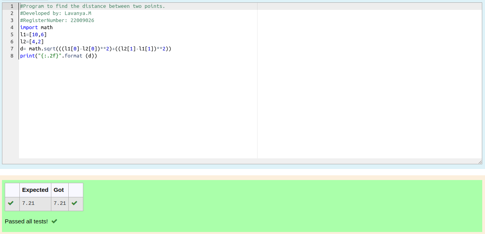

# DISTANCE-BETWEEN-TWO-POINTS

## AIM:
To write a python program to find the distance two 2 points
## ALGORITHM:

### Step 1: 
Import numpy package
### Step 2: 
Get the input values
### Step 3: 
Substitute the values in the distance formula  
### Step 4: 
Substitute in the formula
### Step 5: 
End the rpogram

### PROGRAM:
```python
#Program to find the distance between two points.
#Developed by: Lavanya.M
#RegisterNumber: 22009026
import math
l1=[10,6]
l2=[4,2]
d= math.sqrt(((l1[0]-l2[0])**2)+((l2[1]-l1[1])**2))
print("{:.2f}".format (d))
```

### OUTPUT:



### RESULT:
Thus the distance between two points is found
